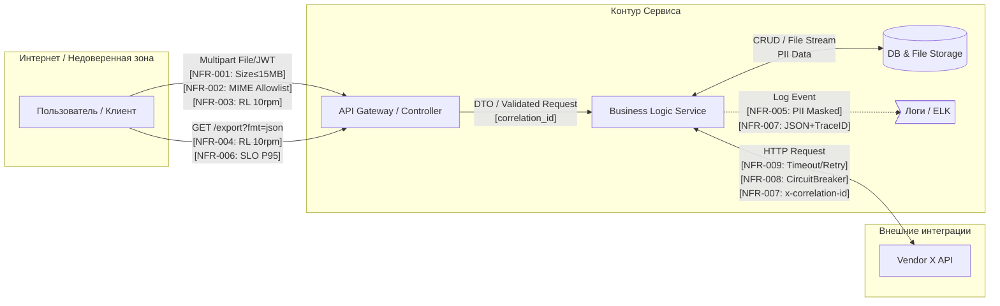

# S04 - DFD

## Базовый каркас (mermaid)

```mermaid
flowchart LR
  subgraph Internet[Интернет / Недоверенная зона]
    User[Пользователь / Клиент]
  end

  subgraph ServiceScope[Контур Сервиса]
    API[API Gateway / Controller]
    Logic[Business Logic Service]
    DB[(DB & File Storage)]
    
    LogSink>Логи / ELK]
  end

  subgraph ExternalScope[Внешние интеграции]
    Vendor[Vendor X API]
  end


  User -- "Multipart File/JWT<br>[NFR-001: Size≤15MB]<br>[NFR-002: MIME Allowlist]<br>[NFR-003: RL 10rpm]" --> API

  User -- "GET /export?fmt=json<br>[NFR-004: RL 10rpm]<br>[NFR-006: SLO P95]" --> API

  API -->|"DTO / Validated Request<br>[correlation_id]"| Logic

  Logic <-->|"CRUD / File Stream<br>PII Data"| DB

  Logic <-->|"HTTP Request<br>[NFR-009: Timeout/Retry]<br>[NFR-008: CircuitBreaker]<br>[NFR-007: x-correlation-id]"| Vendor

  Logic -.->|"Log Event<br>[NFR-005: PII Masked]<br>[NFR-007: JSON+TraceID]"| LogSink
```

